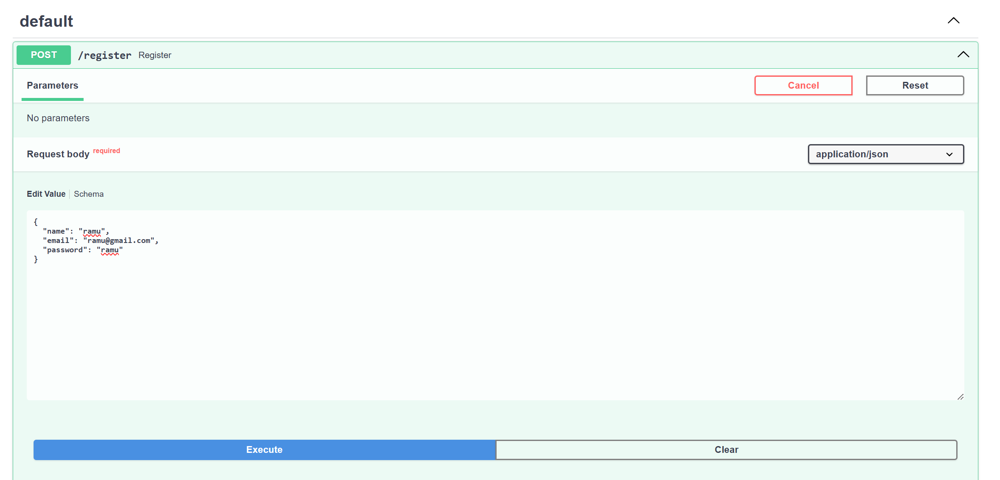
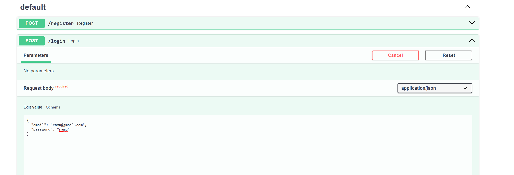
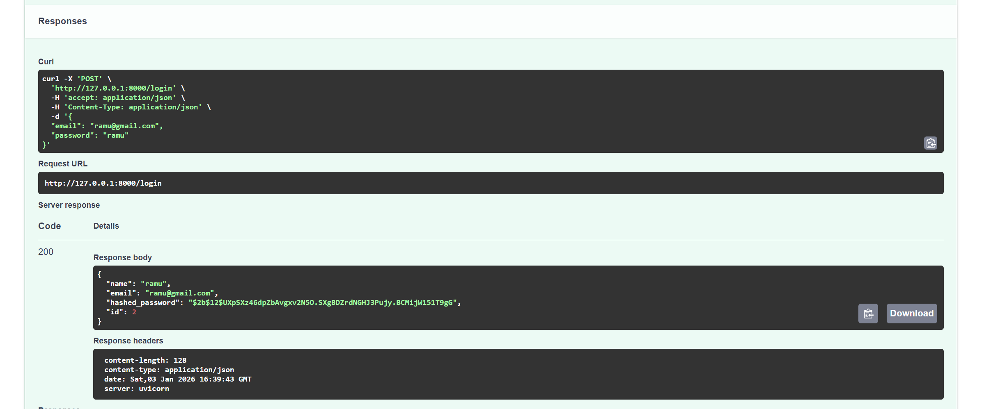
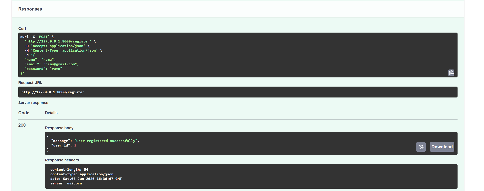
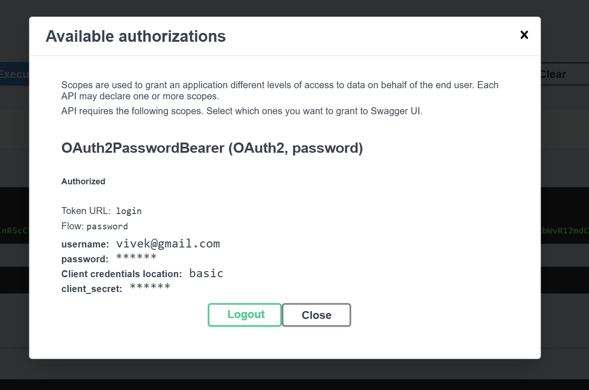
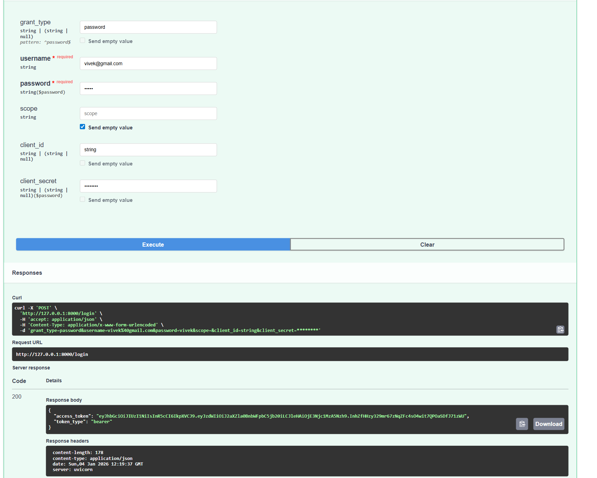
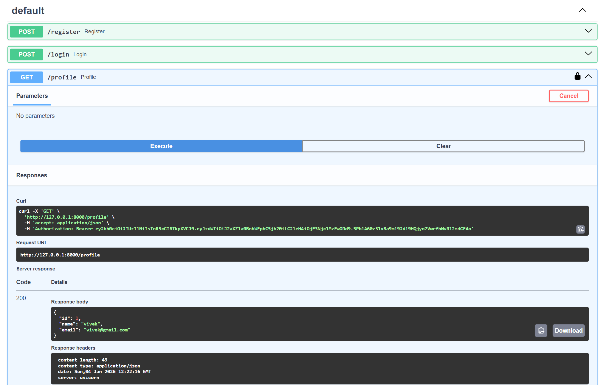

# FastAPI Backend Examples

This repository contains **practical FastAPI examples** that I created while
learning backend development with FastAPI.

The focus of this repository is **hands-on practice**, not theory.

---

## 📁 Project Structure

```text
FastApi-backend-examples/
├── auth/
├── basics/
├── sql_and_files/
├── jwt/
├── images/
├── README.md
└── .gitignore

```

---

## 📌 basics

This folder contains **core FastAPI concepts**, including:
- Basic route creation
- Path parameters
- Query parameters
- Request handling
- Pydantic models for validation

Each file demonstrates one concept in a simple and clear way.

---

## 📌 sql_and_files

This folder contains **intermediate FastAPI concepts**, including:
- File upload handling
- Form and file combined requests
- Basic SQLModel models
- SQLModel

---
## 📌 jwt

This folder contains a complete **JWT-based authentication system**, including:
- User Registration
- OAuth2 password-based login
- JWT access token generation
- Protected routes using Bearer tokens
- Secure password hashing using bcrypt
---
## 🔐 JWT Authentication

#### Register API



#### Login API



#### JWT Flow




---

## 🛠 Tech Stack
- Python
- FastAPI
- SQLAlchemy
- SQLite
- OAuth2 & JWT
- Secure password hashing using bcrypt

---

## 🎯 Purpose

This repository is maintained as:
- A personal learning log
- A reference for FastAPI basics
- A practice repository for backend development

More advanced concepts may be added in the future.
